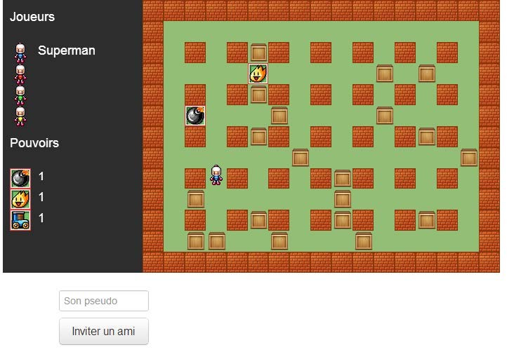
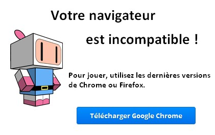
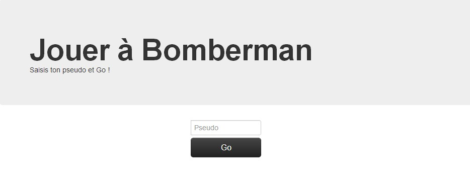
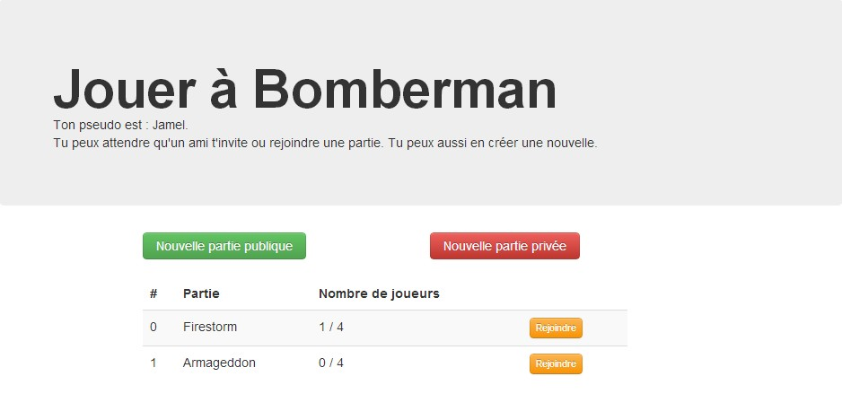
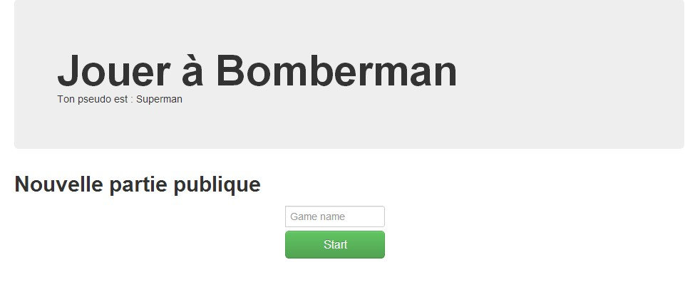
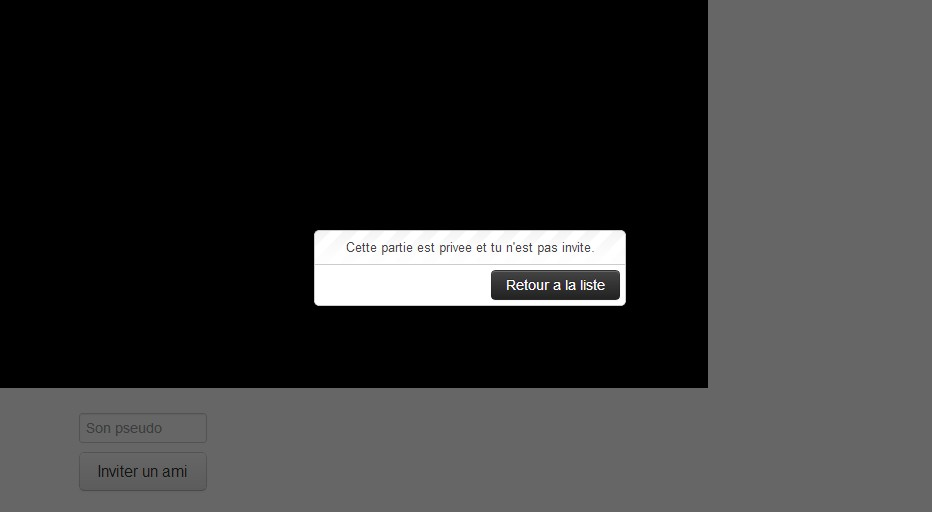
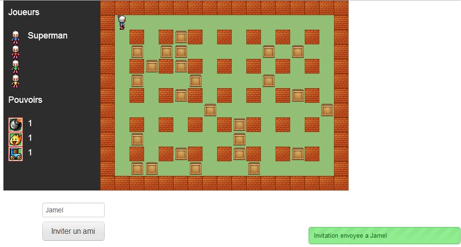
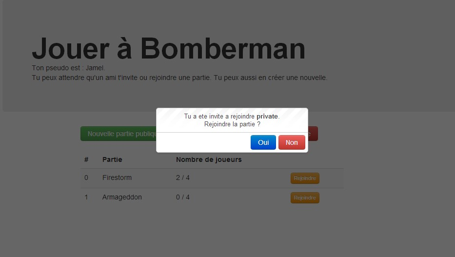

# Bomberman (School project 2011-2012 at SUPINFO)

## Important
Ce projet date de 2012 et a été développé dans le cadre d'un projet de fin d'études. Il n'a pas été relancé depuis...
Cette documentation reprend le document rendu avec le projet.

Projet mis à disposition pour information seulement.

## Installation

### Serveur
La partie serveur de bomberman a été développée sous JavaScript. Le code est exécuté sur un serveur nodejs. L'installation de nodejs sur le serveur hébergeant le jeu est donc indispensable.

### Versions des modules
| Module     | Version  |
| ---------  | -------- |
| nodejs     | 0.8.9    |
| ejs        | 0.8.2    |
| express    | 3.0.0rc4 |
| socket.io  | 0.9.10   |
| underscore | 1.3.3    |

Il faut tout d'abord installer les modules dont dépend le jeu. Pour ce faire exécutez la commande `npm install`. Le programme `npm` lira le fichier `package.json` afin de télécharger les modules nécessaires. Une fois les modules téléchargés le serveur du jeu est prêt à être lancé.
Pour lancer le serveur exécutez la commande node app.
Le serveur démarrera et le jeu est accessible à partir de `http://localhost:3389`
Le serveur web écoute le port `3389`, le port doit donc être ouvert.

### Client
L'application web fonctionne sur n'importe quel navigateur supportant les spécifications d'HTML5.
Si l'utilisateur essaye de jouer à Bomberman avec un navigateur incompatible, il trouvera une image l'informant de l'incompatibilité de son navigateur avec le jeu, il pourra cliquer sur l'image pour télécharger un navigateur compatible.

*Attention* : bien qu'Internet Explorer 9 supporte le canvas, il reste incompatible avec le jeu.
A la date de l'écriture de ce manuel, les navigateurs testés supportant totalement le jeu sont : Google Chrome version 22.0 et Firefox version 15.0.1.

## Jeu

Pour jouer à Bomberman il faut tout d'abord se rendre sur http://localhost:3389. Le joueur sera invité à saisir un pseudo.

Ensuite le joueur sera redirigé vers une page listant les parties publiques créées par d'autres joueurs ou par lui-même.

A partir de cet écran vous avez le choix entre plusieurs options :
- Rejoindre une partie existante : pour rejoindre une partie, cliquez sur le bouton **Rejoindre** de couleur orange. Vous ne pourrez rejoindre la partie que si le nombre de joueurs est inférieur à 4, autrement le bouton **Rejoindre** sera désactivé. Si vous tentez néanmoins de de rejoindre la partie un message vous informera que la partie est pleine et vous ne pourrez pas jouer.
- Créer une nouvelle partie publique : pour créer une nouvelle partie publique cliquez sur le bouton vert **Nouvelle partie publique**.
- Créer une nouvelle partie privée : pour créer une nouvelle partie privée cliquez sur le bouton vert **Nouvelle partie privée**.

En cliquent sur Start, la partie sera créée et elle sera affichée dans la liste pour permettre aux autres joueurs de la rejoindre.
Créer une nouvelle partie privée : Vous pouvez aussi créer une nouvelle partie privée. Si vous créer une partie privée, la partie ne sera pas visible dans la liste et les autres joueurs doivent être invité pour la rejoindre. Si vous tenez de rejoindre une partie privée sans y être invité, un message vous informera que la partie est privée et vous ne pourrez pas jouer.

Pour pouvoir jouer à une partie privée il faut être invité par un joueur dans la partie. Pour inviter un joueur dans une partie publique ou privée, il suffit de saisir son pseudo et de cliquer sur Inviter un ami.

## Documentation technique

### Serveur
Le code côté serveur a été développé en JavaScript. Le programme est destiné à être exécuté par un serveur nodejs.
Pour installer nodejs, il suffit de se rendre http://nodejs.org/download/ afin de télécharger les programmes d'installation correspondant à votre plateforme. L'installation de nodejs installera également npm qui facilite l'installation des modules pour nodejs.
Nodejs peut être installé sous différentes plateformes : Linux, Windows et Mac.
Le code a été testé sous nodejs version 0.8.9 sous Windows et Ubuntu.

### Client
Le client a été développé en JavaScript.
Pour faciliter l'utilisation du canvas, j'ai utilisé le Framework easeljs http://createjs.com/#!/EaselJS.
Easeljs est une librairie JavaScript faisant partie de la suite createjs qui regroupe en tout 4 librairies :
- easeljs : pour la gestion des images et des animations
- preloadjs : utilisée dans mon projet pour le chargement des ressources
- soundjs : librairie permettant la gestion du son
- tweenjs : librairie offrant des fonctions d'animation
Mon choix s'est porté sur easeljs car c'est un Framework qui est maintenu, en constante amélioration et qui possède une communauté d'utilisateurs assez active. C'est aussi un Framework qui a de grandes promesses : le projet est maintenu par un développeur d'Adobe, d'ailleurs petit à petit Adobe facilitera l'utilisation de la suite createjs en l'intégrant au sein de l'IDE destiné au développement web : Dreamweaver.
### Librairies utilisées
- easeljs
- preloadjs
- noty
- jquery
- socket.io
- blackbirdjs
- underscore
